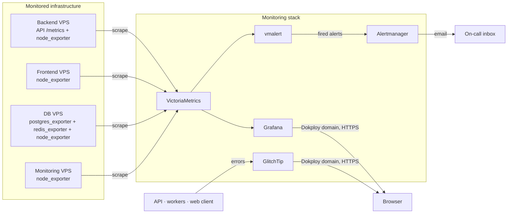

# Genario — Monitoring

**The self-hosted observability stack that watches Genario in production.** It collects
metrics from four servers and every application instance, stores and evaluates them,
renders dashboards, delivers alerts when something breaks, and captures application errors
— all running on infrastructure owned by the project, with no third-party SaaS involved.

Everything here is configuration as code: dashboards, alert rules, scrape targets and host
provisioning all live in git and deploy the same way the applications do.

> **Companion repositories:** [backend](https://github.com/genario-ru/backend) ·
> [web client](https://github.com/genario-ru/frontend)

---

## What it is built from

| Component | Role |
| --- | --- |
| **VictoriaMetrics** | Scrapes every target and stores the time series; the single metrics backend |
| **vmalert** | Evaluates alert rules against VictoriaMetrics and fires alerts |
| **Alertmanager** | Groups, deduplicates and routes fired alerts to email |
| **Grafana** | Renders dashboards, provisioned from files rather than clicked together in the UI |
| **GlitchTip** | Self-hosted error tracking for the API, workers and web client, with its own PostgreSQL and Valkey |
| **Exporters** | `node_exporter`, `postgres_exporter` and `redis_exporter` on the monitored hosts |
| **Bootstrap scripts** | Idempotent shell scripts that install exporters, create system users, write systemd units and scope firewall rules |

The whole stack is a Docker Compose deployment managed by Dokploy, deployed from `main`
through GitHub Actions.

---

## Architecture

Note the direction of every arrow into the stack: monitoring **pulls** from the
infrastructure. Nothing on a monitored host needs credentials for the monitoring VPS, and
losing the monitoring server cannot take production down with it.

---

## What is monitored

| Scrape job | Target | Interval |
| --- | --- | --- |
| `backend` | The API's `/metrics` over HTTPS, for **production and stage** separately | 15s |
| `backend-node` | Host metrics of the backend VPS | 30s |
| `frontend-node` | Host metrics of the frontend VPS | 30s |
| `db-node` | Host metrics of the database VPS | 30s |
| `monitoring-node` | Host metrics of the monitoring VPS itself | 30s |
| `postgres` | PostgreSQL exporter, **production and stage** instances | 30s |
| `redis` | Redis exporter, **production and stage** instances | 30s |

Production and stage are separate targets on the same job, distinguished by labels rather
than by duplicated configuration — which is why one dashboard can switch between
environments instead of existing twice.

Application-level metrics come from the backend itself: request rate, response classes,
latency histograms and in-flight requests, all labelled by route and status class.

---

## Dashboards

Eight dashboards are committed as JSON and provisioned into Grafana automatically, grouped
into `Backend`, `Frontend`, `DB` and `Monitoring` folders:

- **Backend Overview** — request rate, response classes, latency, in-flight requests,
  process memory and CPU, uptime; switchable between production and stage.
- **Backend / API Endpoints** — per-endpoint breakdown, same environment switch.
- **Host Overview** (one per VPS) — CPU, memory, disk, load, network and uptime.
- **Postgres Overview** — exporter and database health, connections, transaction rate,
  database size, deadlocks, checkpoint pressure.
- **Redis Overview** — exporter and Redis health, memory usage, clients, ops/sec,
  evictions, rejected connections, persistence health.

Because dashboards live in git with stable UIDs, a dashboard change is reviewed in a pull
request and cannot be lost when a container is recreated.

---

## Alerting

Fourteen baseline rules are evaluated by vmalert and routed to email by Alertmanager.
Every rule carries a `for:` duration, so a transient blip does not page anyone.

| Category | Rules |
| --- | --- |
| **Availability** | `BackendDown`, `BackendNodeDown`, `FrontendNodeDown`, `DbNodeDown`, `MonitoringNodeDown`, `PostgresDown`, `RedisDown` |
| **Application health** | `BackendHigh5xxRate` (5xx rate above threshold for 10 min), `BackendHighLatencyP95` (p95 above one second for 10 min) |
| **Host capacity** | `HostHighCpu`, `HostLowMemory`, `HostDiskAlmostFull` |
| **Datastore pressure** | `PostgresTooManyConnections`, `RedisHighMemoryUsage` |

The split of responsibilities is deliberate: **vmalert** decides *whether* something is
wrong, **Alertmanager** decides *who hears about it and how often*. Thresholds are
documented as starting defaults to be revised against real production behaviour rather
than treated as settled truth.

---

## Error tracking

GlitchTip runs alongside the metrics stack as a self-hosted, Sentry-compatible error
tracker, backed by its own PostgreSQL and Valkey containers. The API, the workers and the
web client all report to it with release tagging, so a production stack trace can be traced
back to the commit that introduced it. Metrics answer *is something wrong*; GlitchTip
answers *what exactly broke, for whom, and since which release*.

---

## Host provisioning

Four bootstrap scripts turn a bare VPS into a monitored one: they install the right
exporters, create dedicated unprivileged system users, write systemd units, start the
services, and — when given the monitoring host's address — add firewall rules that expose
exporter ports to that address only.

They are written to be re-runnable: users are created only when missing, units are
rewritten deliberately, and each script ends by printing the next verification step. Adding
a server is a repeatable operation rather than a remembered sequence of SSH commands.

---

## Security and network posture

- **Only two services are reachable from the internet** — Grafana and GlitchTip, published
  over HTTPS through Dokploy domains. VictoriaMetrics, vmalert, Alertmanager and
  GlitchTip's PostgreSQL and Valkey stay on an internal Docker network with no published
  ports.
- **Exporters are firewalled to the monitoring host.** Ports 9100, 9187, 9121 and their
  stage counterparts accept traffic from the monitoring VPS address only.
- **The backend's `/metrics` endpoint is IP-allowlisted** in the application itself, so
  even though it lives on the public API domain, only the monitoring host can read it.
- **No credentials in git.** Alertmanager's configuration is committed as a template with
  placeholders and rendered from environment variables at container start; only
  `.env.example` with placeholder values is tracked.
- **The monitoring stack has no write access to production.** It scrapes read-only
  endpoints and connects to databases through a dedicated `pg_monitor` role that can read
  statistics and nothing else.

---

## Current scope

The stack covers infrastructure health, API performance and application errors. Worker
queue metrics, log aggregation, distributed tracing and a high-availability configuration
of VictoriaMetrics are deliberately out of scope at this stage — a single-node deployment
with one-month retention matches the traffic this product actually serves, and the
boundary is documented rather than discovered during an incident.

---

## Repository map

| Path | Contents |
| --- | --- |
| `docker-compose.yml` | The full stack: Grafana, VictoriaMetrics, vmalert, Alertmanager, GlitchTip and its dependencies |
| `victoriametrics/scrape.yml` | Scrape jobs and target templates |
| `vmalert/rules/alerts.yml` | Alert rules |
| `alertmanager/alertmanager.yml.tpl` | Routing and delivery template, rendered at startup |
| `grafana/dashboards/` | Committed dashboard JSON, grouped by folder |
| `grafana/provisioning/` | Datasource and dashboard provisioning |
| `scripts/` | Bootstrap scripts for the backend, frontend, database and monitoring hosts |
| `.github/workflows/` | Deployment pipeline |
| `AGENTS.md`, `CLAUDE.md`, `.cursor/`, `.agents/` | Working agreements and repeatable workflows for AI coding tools |

---

## License

Source-available for review only. See [LICENSE](LICENSE) — no permission is granted to
use, copy, modify or distribute this configuration.
